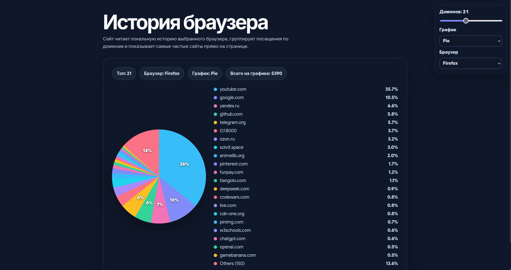

# Browser History Website

Веб-приложение на FastAPI, которое читает локальную историю популярных браузеров и показывает самые посещаемые домены в виде диаграммы на странице.



## Что делает

- находит профиль выбранного браузера в стандартной Linux-директории
- поддерживает Firefox, Google Chrome, Chromium, Brave, Microsoft Edge, Opera и Vivaldi
- копирует SQLite-базу истории во временную директорию, чтобы безопасно читать файл
- читает URL и количество посещений из истории браузера
- группирует посещения по доменам
- показывает топ посещаемых доменов на HTML-странице
- позволяет выбрать тип графика: `bar`, `plot`, `stem`, `stackplot`, `stairs`, `boxplot`, `violinplot`, `pie`
- отдает те же данные в JSON-формате

## Структура

```text
history_website/
├── main.py
├── config.py
├── requirements.txt
├── routers/
│   ├── __init__.py
│   └── history.py
├── services/
│   ├── __init__.py
│   ├── browser_history.py
│   ├── charts.py
│   └── firefox_history.py
├── static/
│   ├── app.js
│   └── styles.css
└── templates/
    └── index.html
```

## Установка

```bash
python -m venv .venv
.venv/bin/pip install -r requirements.txt
```

## Запуск

```bash
.venv/bin/fastapi dev main.py
```

После запуска откройте адрес, который покажет FastAPI. Обычно это `http://127.0.0.1:8000`.

## Страницы и API

- `/` - страница с диаграммой посещений
- `/api/history` - JSON с данными диаграммы

Количество доменов на странице меняется ползунком, браузер и тип графика выбираются в списках под ним. Для API можно использовать параметры `limit`, `chart_type` и `browser`:

```text
http://127.0.0.1:8000/api/history?limit=15&chart_type=pie&browser=chrome
```
